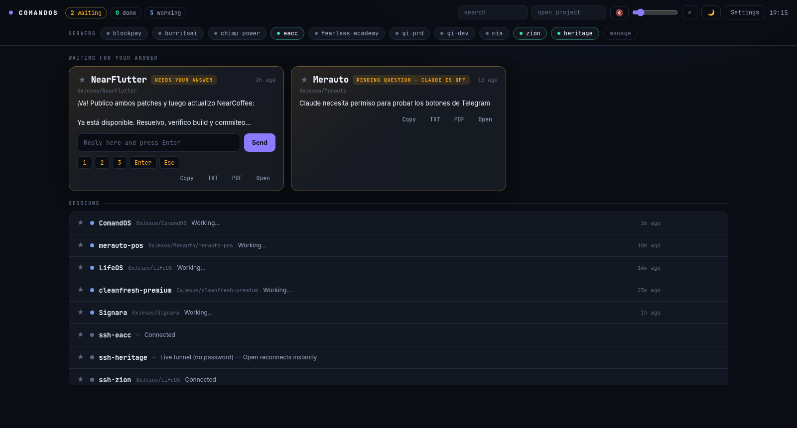

# ComandOS — Local-First Mission Control for AI Coding Agents

Run Claude Code, OpenAI Codex CLI, Gemini CLI, OpenCode, and other coding
agents side by side in persistent tmux terminals. Get actionable
notifications, manage direct SSH sessions, monitor plan usage, and continue
securely from your desktop, phone, or tablet through the remote terminal
PWA over Tailscale — without a hosted ComandOS backend, external ComandOS
database, telemetry, or SSH proxy.

[](./LICENSE)
[](https://github.com/sponsors/0xAI-Builders)
[](https://buymeacoffee.com/0xjesus)

**[Léeme en español →](./README.es.md)**



## Why

When you run many coding agents at once, the problem isn't terminals — it's
**knowing which one needs you and getting back to it without friction**.
ComandOS turns Claude Code, Codex CLI, Gemini CLI, OpenCode, and regular shell
sessions into an event-driven flow: the system interrupts you (voice +
actionable popup), you answer with a key or a line, and you keep going. No
tab-scanning.

## Local-first by design

ComandOS runs on your computer. Runtime state lives in local tmux sessions,
JSON and configuration files, and local SQLite at
`~/.claude/hooks/comandos-usage.sqlite`. There is no hosted ComandOS backend,
external ComandOS database, telemetry service, or ComandOS SSH proxy.

SSH hosts are read from `~/.ssh/config`, and the installed OpenSSH client
connects directly from your computer to the selected server. ComandOS does not
upload your SSH configuration or private keys to a ComandOS service. If you
explicitly request passwordless setup, `ssh-copy-id` copies only the selected
public key to that server.

Some features cross the network only when you use or configure them:

- Agent CLIs communicate with their own AI providers under those providers'
  terms and settings.
- Plan-usage monitoring may query Anthropic or OpenAI usage endpoints directly
  when matching credentials are configured.
- Remote access through Tailscale Serve is optional and stays inside the
  tailnet configuration you control.
- Telegram control is optional; when enabled, notification content, replies,
  and commands pass through the Telegram Bot API.
- Voice playback is local after installation; `cc-doctor --fix` may download
  an optional Piper voice model when you ask it to repair voice support.

## What you get

- **Live dashboard** (`127.0.0.1:4777`): whatever waits for YOUR answer shows up big,
  with the question's real options as buttons. Respond without switching windows.
- **Actionable popups**: full text with rendered markdown (tables included),
  1/2/3 buttons, inline reply, Copy, and "View ALL". Never answer blind.
- **Native app** (GTK + VTE): one tab per session with a status dot
  (amber = waiting · blue = working · green = done), **Ctrl+K** jumps to any session,
  renameable tabs, splits, and Night/Day/Warm themes.
- **Copy & export** any response: clipboard, `.txt`, or PDF with rendered markdown —
  from the terminal, the popup, or the dashboard.
- **Local voice** (piper, 100% offline) + chime, one global volume that everything respects.
- **SSH manager**: CRUD over `~/.ssh/config`, one-click connect, detects live
  multiplexed tunnels (no-password reconnect).
- **Snippets**: save reusable shell commands (one-liners or multi-line scripts) and paste them into the active session with **Ctrl+Shift+K**. Bracketed paste — nothing runs until you press Enter.
- **Telegram**: optional buttons on notifications, reply to answer, `/ls /out /run`.
- **Local-first state**: tmux, JSON/configuration files, and local SQLite survive
  restarts without a hosted ComandOS service.
- UI in **English and Spanish** (auto-detected from `$LANG`, switchable in Settings).

## Install

```bash
git clone https://github.com/0xAI-Builders/comandos.git
cd comandos && ./install.sh
```

Requires Linux with GNOME/X11, `python3-gi`, `tmux`, `jq`.
Recommended: `xclip`, `wmctrl`, `piper` (voice), `kitty`.
Open **ComandOS** from your app menu, or the dashboard at <http://127.0.0.1:4777>.

## Agents

| Agent | Integration | What you get |
|---|---|---|
| **Claude Code** | native hooks (auto via `install.sh`) | working · waiting **with real options** · done · full reply |
| **Codex CLI** | lifecycle hooks + `notify` fallback (`cc-agents setup`) | working · waiting for permissions · done + last message |
| **OpenCode** | plugin (`cc-agents setup`) | working · waiting · errors · done |
| **Gemini CLI** | hooks (`cc-agents setup`) | working · waiting · done · full reply |
| **Antigravity CLI** (`agy`) | hooks (`cc-agents setup`) | working · done — verified on a real session |

One command connects everything you have installed: **`cc-agents setup`**.
If Codex asks you to review new hooks, open `/hooks` in Codex and trust the
ComandOS hook once.
Any other agent can join with a single HTTP call:
`POST 127.0.0.1:4777/event {"agent","event","cwd","msg?","full?"}`.

## Phone & tablet (secure)

Keep prompting from your phone — securely, in one command:

```bash
cc-mobile          # connects over your tailnet and shows a QR to pair
```

Scan the QR, open the dashboard, "Add to Home Screen" — it installs as an app
(PWA), no App Store. Answer prompts, reply to agents, run sessions from bed.

**Want the FULL interactive terminal on your phone?** Install `ttyd` and run
`cc-webterm` — every session gets a **Terminal** button that opens the real,
live, interactive terminal (xterm.js attached to the same tmux session). Type,
scroll, run `vim` — exactly like sitting at your desk, shared in real time.
It is routed under `/term` by the same Tailscale Serve. ComandOS passes the
existing access token as a per-connection launch capability; the attach helper
rejects the connection before opening tmux when it is missing or wrong. There
is no second login prompt.

**When you enable remote access, security is layered:**
- **Tailscale** (WireGuard): access follows your tailnet policy for authorized users and devices, with end-to-end encryption. ComandOS uses Serve, never public Funnel.
- **Automatic TLS** via `tailscale serve` (https on your tailnet).
- **Access token**: protects the remote dashboard, cc-dash API, and every
  interactive terminal attachment. `cc-dash` still binds only to `127.0.0.1`;
  Serve bridges it.
- **Interactive terminal boundary**: ttyd also binds only to loopback. Its
  attach helper validates the same token before opening tmux, while Tailscale
  policy limits who can reach `/term` and `:8443` in the first place.
- **Anti-DNS-rebinding**: Host-header allowlist (loopback + `*.ts.net`).
- Local clients receive the terminal capability automatically; remote/proxied
  dashboard and API requests must present the access token.

`cc-mobile off` stops exposing it.

## Platforms

| Platform | Status |
|---|---|
| **Linux** (GNOME/X11) | Everything — this is the daily driver ✓ |
| **Windows 11** | Via **WSL2 + WSLg** (GUI app, audio and all) ✓ |
| **macOS** | Engine + web dashboard + **native app** (`cc-app`, PyObjC + WKWebView; needs `pip install pyobjc-framework-Cocoa pyobjc-framework-WebKit` + `brew install tmux jq ttyd`) + native notifications/voice (`osascript`, `say`, `afplay`); popups pending — beta, [testers welcome](https://github.com/0xAI-Builders/comandos/issues) |

### Windows setup (WSL2 + WSLg)

1. In PowerShell (as Administrator): `wsl --install -d Ubuntu-24.04` and reboot when asked.
2. Open Ubuntu from Start Menu and set your Linux username/password.
3. Inside Ubuntu: `git clone https://github.com/0xAI-Builders/comandos.git && cd comandos && ./install.sh`
4. If the installer tells you to enable systemd, follow its instructions: from PowerShell run `wsl --shutdown`, reopen Ubuntu, and run `./install.sh` again.
5. Find **ComandOS** in your Windows Start Menu (WSLg publishes it automatically) or open Edge at `http://127.0.0.1:4777`.

## Pieces

| Piece | What it is |
|---|---|
| `bin/cc-dash` | Engine: dashboard + tmux/ssh actions (127.0.0.1:4777) |
| `bin/cc-app` | Native app: dashboard + terminal tabs |
| `bin/cc-notifyd` | Actionable popup daemon |
| `bin/cc-telegram` | Telegram bridge |
| `hooks/cc-notify.sh` | Claude Code hook: state + notifications |
| `bin/ccx` | One tmux session per project (`ccx name`, `ccx -a codex name`) |
| `bin/cc-agents` | Connect Codex / OpenCode / Gemini / Antigravity |
| `bin/cc-doctor` | Diagnostics: checks platform, deps, services (`--fix` offers batched fixes) |
| `bin/cc-mobile` | Expose the dashboard to your phone over Tailscale (secure) |
| `bin/cc-webterm` | Full interactive web terminal (ttyd) for your sessions |

## Support

If it saves you time, buy me a coffee — it keeps the project alive:
[Buy Me a Coffee](https://buymeacoffee.com/0xjesus) ·
[GitHub Sponsors](https://github.com/sponsors/0xAI-Builders)

## License

[MIT](./LICENSE)
